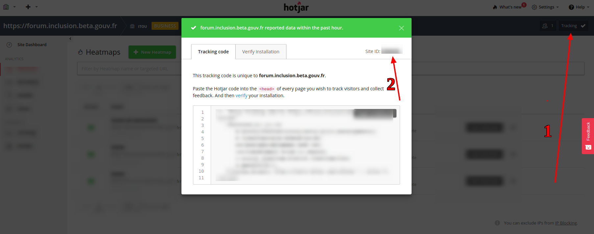

Ce composant permet d'activer Hotjar dans un forum Discourse auto-hébergé. 

Allez dans Discourse, puis cliquez sur Personnaliser > Thèmes > Composants > Installer.
Sélectionnez l'option "Depuis un dépôt git" puis collez le lien git vers ce dépôt.

Une dernière étape ! Connectez-vous sur Hotjar et récupérez le _site ID_.

Collez cet identifiant dans Paramètres de thème > site id. Puis incluez le composant à votre thème et attendez quelques minutes. 

Vérifier que l'installation a réussi est très simple. Il vous suffit d'ajouter le paramètre `?hjVerifyInstall=siteID` à votre url, en remplaçant bien entendu `siteID` par la véritable valeur.

